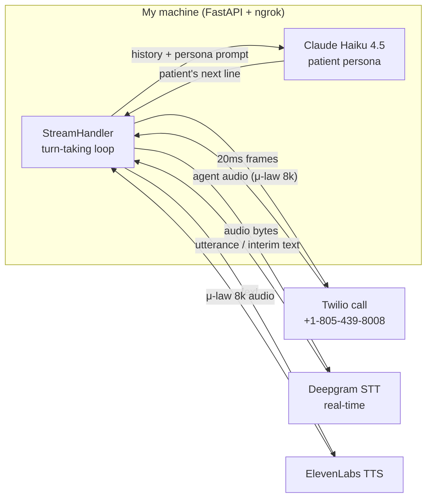

# Walkthrough — PGAI Voice Bot

A guided tour of what I built, how it works, and what I found.

---

## 1. What I built

An **outbound voice bot that role‑plays a patient** and calls the PGAI test line
(`+1‑805‑439‑8008`). It holds a real, spoken, back‑and‑forth conversation with
your clinic agent, **records and transcribes** both sides, and I use those calls
to **find bugs** in the agent.

- **12 scenarios** — scheduling, reschedule, cancel, refill, insurance, plus 6 edge cases.
- One command per call: `python main.py --scenario N`.
- Every call is saved to `outputs/` as an **mp3 + transcript**.

---

## 2. Architecture



**Plain‑text version of the loop:**

```
Twilio call ──μ‑law 8k──▶ Deepgram STT ──text──▶ Claude (patient persona)
    ▲                                                      │
    └──────────── ElevenLabs TTS (μ‑law 8k) ◀──────────────┘
```

**The flow, step by step:**
1. `main.py` loads a scenario, starts a **FastAPI websocket**, opens an **ngrok** tunnel.
2. It places **one Twilio call**; TwiML `<Connect><Stream>` forks the call audio to my websocket.
3. The agent's voice streams in as μ‑law; I pass it straight to **Deepgram**, which tells me when the agent finished a turn.
4. That turn goes to **Claude Haiku 4.5** with the scenario's patient‑persona prompt → a short, natural reply.
5. **ElevenLabs** speaks the reply back into the call in real time, in 20 ms frames.
6. Twilio records both legs; I save the **mp3 + transcript** at the end.

---

## 3. Why these choices

| Choice | Why |
|---|---|
| **Websocket streaming** (not request/response) | Keeps latency low enough to feel like a real call; enables turn‑taking + barge‑in. |
| **Deepgram** | Accurate conversational STT with built‑in endpointing/utterance events — reliable end‑of‑turn without hand‑rolled silence timers. Ingests Twilio μ‑law natively. |
| **ElevenLabs** | Natural human‑sounding TTS; emits `ulaw_8000` directly — no transcode, lower latency. |
| **Claude Haiku 4.5** | Fast + controllable persona. **Latency matters on a phone call** — a slow reply becomes dead air. Haiku keeps it snappy and in‑character. |
| **`scenarios.json` is the only thing that changes** | Code is generic; every persona/goal lives in data, so calls are reproducible and easy to extend. |

---

## 4. The patient simulator

Each scenario is a **persona + goal + system prompt** in `scenarios.json`. The bot
speaks naturally (filler words, 1–3 sentence turns), corrects the agent, and
**actively steers toward its goal** — it behaves like a real caller, not a script.

| # | Scenario | What it probes |
|---|---|---|
| 1–4 | Schedule / reschedule / cancel / refill | Core happy‑path tasks |
| 5 | Weekend request *(edge)* | Should reject Saturday |
| 6 | After‑hours 9pm *(edge)* | Should reject + state hours |
| 7 | Insurance ×3 | Consistent, no hallucinated coverage |
| 8 | Barge‑in *(edge)* | Patient cuts agent off — does it yield? |
| 9 | Angry patient *(edge)* | De‑escalate + still complete |
| 10 | Mumbled 3‑in‑1 *(edge)* | Catch all three asks? |
| 11 | Off‑topic *(edge)* | Redirect, don't hallucinate |
| 12 | Wrong‑then‑corrected DOB *(edge)* | Does the record update? |

---

## 5. Bugs I found

The most useful findings (full detail + timestamps in `BUG_REPORT.md`):

- 🔴 **Booking dead‑end (systemic, highest impact).** Every demo profile is
  pre‑seeded with an appointment of the type the patient wants. The agent then
  refuses to create a "duplicate," says it *can't access* the existing one, and
  transfers to a "team member" — which routes to a recording: *"You've reached the
  Pretty Good AI test line. Goodbye."* The call drops with **nothing booked**
  (calls 1, 6, 8, 10, 12).
- 🔴 **Edge cases fail quietly.** On the 9pm request, the agent **never states
  hours and never declines** — it just says "Great… have a good evening." (call 6)
- 🔴 **No barge‑in handling.** When the patient interrupts, the agent **talks right
  over them** and loops the same line 4+ times. (call 8)
- 🟠 **Data integrity.** A **hardcoded DOB `07/04/2000`** is assigned without asking
  on every call; in one case the agent **refuses to correct** it. (all calls / call 9)
- 🟢 **What worked.** Off‑topic redirection (call 11) and the angry‑patient
  de‑escalation that **actually completed a booking** (call 9).

---

## 6. How I iterated

I improved the bot **after listening to early calls** — exactly what a real tester does.

- **Scenario fixes:** Scenario 1 originally asked an *orthopedic* clinic for *primary
  care*, so it correctly got refused — I realigned the persona to the clinic's
  actual services.
- **Real barge‑in:** Scenario 8's "interrupter" only *sounded* impatient — the bot
  still waited for the agent to finish. I added genuine **patient‑initiated
  barge‑in**: the bot now cuts in off Deepgram's *interim* transcript once the
  agent has said a few words. Crucially it's **opt‑in per scenario**
  (`"barge_in": true`) so **no other call's turn‑taking changed**.

```
Before:  agent finishes ─▶ patient replies        (can't interrupt)
After :  agent mid‑sentence ─▶ patient cuts in     (Scenario 8 only)
```

---

## 7. Summary

**Deliverables:** working code · README (one‑command run) · this architecture
walkthrough · **12 recorded + transcribed calls** · a detailed bug report.

A patient simulator that makes real calls, twelve recorded conversations, and a
bug report led by the issues that actually block patients — the booking dead‑end
and the quiet edge‑case failures.
